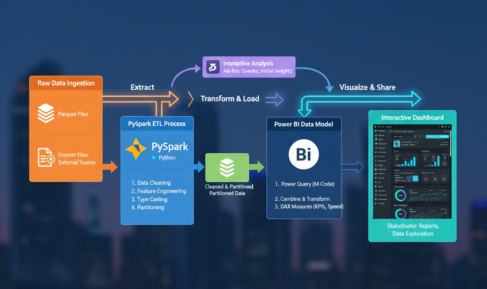

# 🚦 Data-Driven Urban Mobility Analytics Dashboard

## Project Overview

This repository contains the complete end-to-end data pipeline for a **Data-Driven Urban Mobility Analytics Project**. The goal is to ingest, transform, and analyze public transportation/taxi trip data to derive actionable insights related to **efficiency, congestion, and financial performance** for city planners and transportation managers.

The final output is the interactive Power BI dashboard (screenshot provided below) that monitors key performance indicators (KPIs) and trends.

---

## ⚙️ Architecture & Data Flow

The project follows a robust, multi-stage data engineering and analysis pipeline:

1.  **Ingestion (`data_collection.py`):** Raw trip data is collected.
2.  **ETL Transformation (`etl_process.py`):** Heavy-duty data cleaning, feature engineering (duration, speed, time features), and partitioning is performed using **PySpark**.
3.  **Analysis & Validation (`analyze.py` / Jupyter Notebook):** The cleaned data is explored to validate transformations, calculate complex metrics (like Average Speed), and generate initial visualizations.
4.  **Visualization (Power BI):** The final, curated data model is consumed by Power BI to create the interactive user dashboard.

---

## 📈 Key Metrics & Deliverables (Reflecting Dashboard Layout)

The dashboard is structured to track efficiency, demand, and revenue through the following core visualizations:

| Metric Category | Key Dashboard Visuals | Data Fields Used (Axes) |
| :--- | :--- | :--- |
| **Efficiency & Speed** | **Average Speed Trend (MPH)**, **Trip Distance vs. Duration Scatter** | Average Speed, Trip Distance, Trip Duration, Hour of Day. |
| **Demand & Flow** | **Total Trips KPI**, **Trip Count by Hour of Day** | Count of Trip IDs, Pickup Hour, Date Slicer. |
| **Financials** | **Total Revenue KPI**, **Revenue vs. Tipping Rate (Combo Chart)** | Total Amount, Tip Amount, Payment Type. |
| **Usage** | **Average Trip Duration KPI**, **Passenger Count Distribution** | Average Duration, Passenger Count. |

---

## 📂 Repository Contents

| File / Folder | Description |
| :--- | :--- |
| `data_collection.py` | Python script for raw data ingestion. |
| `etl_process.py` | **PySpark** code for cleaning, feature engineering (duration, speed), and data transformation. |
| `analyze.py` | Python/Pandas script for quick data validation and metric calculation. |
| `mobility_analysis.ipynb` | Jupyter Notebook for interactive exploration and generating presentation-ready charts. |
| `dashboard.jpg` | **Screenshot of the final Power BI dashboard** (the visualization referenced above). |
| `data/` | Location for sample raw or intermediate transformed data files. |
| `images/` | Supporting visual assets for the project. |

---

## 🚀 Getting Started (Run the Pipeline)

### Prerequisites

* Python 3.11.9
* PySpark (for the ETL step)
* Required Python Libraries: `pandas`, `pyspark`, `matplotlib`, `seaborn`, `numpy`
* Power BI Desktop (to view the final dashboard)

### Execution Steps

1.  **Data Ingestion:** `python data_collection.py`
2.  **Run ETL (Transformation):** `spark-submit etl_process.py`
3.  **Run Analysis (Optional):** `python analyze.py`
4.  **Explore Interactively:** `jupyter notebook mobility_analysis.ipynb`
---

The next step in your sequence is crucial for those efficiency metrics: **calculating and analyzing the Average Speed**.

Would you like me to provide the Python code for the **Average Speed Analysis** to be included in your `analyze.py` or Jupyter Notebook?
